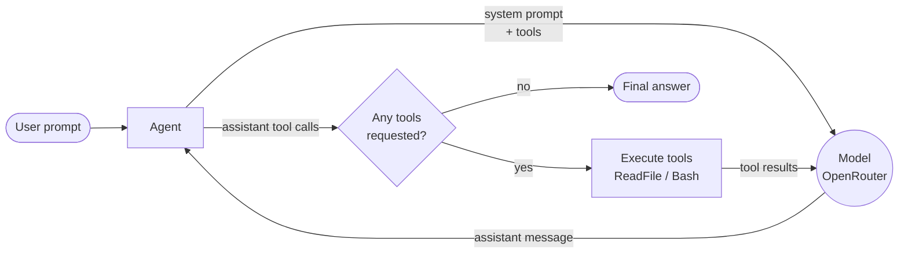

# agent-loop

[](https://nodejs.org)
[](https://www.typescriptlang.org)
[](https://openrouter.ai)

> One-shot terminal agent loop powered by OpenRouter

`agent-loop` takes a prompt, sends it to a specified model available on [OpenRouter](https://openrouter.ai), and iterates tool calls - reading files, running bash commands - until the model produces a final answer.



## Features

- **Agentic loop** - the model can chain tool calls over multiple rounds (up to 8 by default) until it reaches a final answer.
- **Built-in tools** - `ReadFile` for reading file contents, `Bash` for executing shell commands.
- **Any OpenRouter model** - run against paid or `:free` model slugs; list available ones straight from the CLI.
- **Streaming with clean pipes** - live activity (assistant text, tool calls, token usage) is streamed to stderr; the final answer is the only thing printed to stdout, so redirects and pipes capture clean output.
- **Flexible credentials** - OpenRouter API key via environment variable, or per-project/global YAML auth file.
- **Actionable errors** - OpenRouter API errors are rendered as readable, multi-line messages

## Requirements

- [Node.js](https://nodejs.org) >= 26
- An [OpenRouter API key](https://openrouter.ai/keys)
- `bash` (used by the `Bash` tool)

## Getting started

```bash
git clone https://github.com/TinySquid/agent-loop.git agent-loop
cd agent-loop
npm install
cp .env.example .env
# edit .env and set OPENROUTER_API_KEY
```

## Usage

### Run the agent

```bash
./agent.sh -p "what tools are available to you?" -m "qwen/qwen3.8-27b:free"
```

`agent.sh` loads `.env` into the environment and forwards all arguments to the CLI. Without the wrapper:

```bash
npm run agent -- -p "summarize package.json" -m "qwen/qwen3.8-27b:free"
```

> npm requires the double dash (`--`) before flags.

The example slug above is a free model. Use `--list-free-models` to see the current free models, or `--list-models` for non-free ones:

```bash
./agent.sh --list-free-models

cohere/north-mini-code:free
google/gemma-4-31b-it:free
inclusionai/ling-3.0-flash-sante:free
...
```

### Command line options

```
Usage: agent [options]

One-shot terminal agent loop powered by OpenRouter

Options:
  -V, --version          output the version number
  -p, --prompt <prompt>  prompt to run the agent with
  -m, --model <slug>     model slug to run the agent with
  --quiet                suppress the live activity stream; print only the final
                         answer
  --list-free-models     print free model slugs from the OpenRouter API
  --list-models          print non-free model slugs from the OpenRouter API
  -h, --help             display help for command
```

`-p` requires `-m`; the list flags cannot be combined with a prompt.

### Live activity

While the agent runs, its activity streams to stderr (dimmed when attached to a terminal):

```
› round 1 · ReadFile(file_path=package.json)
› round 2 · Bash(command=npm test)
tokens: in 1893 · out 412
```

The final answer is printed to stdout, so you can pipe or redirect it:

```bash
./agent.sh -p "list the scripts in this repo" -m "google/gemma-4-31b-it:free" > scripts.txt
```

Use `--quiet` to suppress the live activity entirely.

### API key configuration

The key is resolved in priority order:

1. `OPENROUTER_API_KEY` environment variable
2. Workspace auth file: `.agent-loop/auth.yaml` in the current working directory
3. Home auth file: `~/.config/agent-loop/auth.yaml`

Auth files are YAML with a single `apiKey` entry:

```yaml
apiKey: sk-or-v1-...
```

The priority order for api key searching is `env -> working directory -> home directory`

## Tools

The agent exposes tools to the model. Tool failures are reported back to the model as error text it can act on.

| Tool       | Description                                                                                                             |
| ---------- | ----------------------------------------------------------------------------------------------------------------------- |
| `ReadFile` | Read the contents of a file (UTF-8)                                                                                     |
| `Bash`     | Execute a shell command in the current working directory. Optional `timeout_ms` parameter (default 60s, capped at 120s) |

When a bash command times out, the process is killed (SIGTERM, then SIGKILL after a 1s grace period) and partial output is returned with exit code 124.

> The `Bash` tool executes whatever the model asks for, with no permission gating.

## Development

```bash
npm run typecheck    # tsc --noEmit
npm run lint         # eslint
npm run format       # prettier --write
npm run format:check # prettier --check
npm test             # vitest run
npm run test:watch   # vitest in watch mode
npm run build        # tsup build to dist/ (ESM, types, sourcemaps)
```

To install the CLI as a global `agent-loop` binary from source:

```bash
npm run build
npm link
```

### Project structure

```
src/
├── cli.ts              # entry point: arg dispatch, event printing, exit codes
├── parse-args.ts       # CLI parsing (commander)
├── agent.ts            # the agent loop itself
├── tools.ts            # tool contracts + ReadFile/Bash implementations
├── tool-execution.ts   # model tool calls in → one tool-result message per call
├── chat-model.ts       # ChatModel seam used by the loop
├── openrouter-model.ts # production ChatModel adapter (OpenRouter SDK)
├── chat-stream.ts      # streamed completion reassembly
├── model-list.ts       # OpenRouter model list fetching + free-model detection
├── credentials.ts      # API key resolution (env → workspace → home)
└── provider-error.ts   # readable formatting for OpenRouter API errors
```
