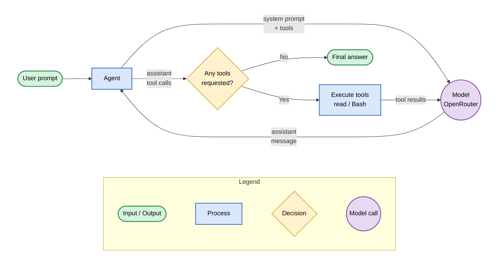

# agent-loop

[](https://nodejs.org)
[](https://www.typescriptlang.org)
[](https://openrouter.ai)

> One-shot terminal agent loop powered by OpenRouter

`agent-loop` takes a prompt, sends it to a specified model available on [OpenRouter](https://openrouter.ai), and iterates tool calls - reading files, running bash commands - until the model produces a final answer.



## Features

- **Agentic loop** - the model can chain tool calls over multiple rounds (up to 8 by default) until it reaches a final answer.
- **Built-in tools** - `read` for paging through file contents, `Bash` for executing shell commands; both bound their output so a runaway read or command can't flood the model.
- **Any OpenRouter model** - run against paid or `:free` model slugs; list available ones straight from the CLI.
- **Streaming with clean pipes** - live activity (assistant text, tool calls, token usage) is streamed to stderr; the final answer is the only thing printed to stdout, so redirects and pipes capture clean output.
- **Flexible credentials** - OpenRouter API key via environment variable, or per-project/global YAML auth file.
- **Actionable errors** - OpenRouter API errors are rendered as readable, multi-line messages

## Requirements

- [Node.js](https://nodejs.org) >= 24.21.0 (LTS)
- An [OpenRouter API key](https://openrouter.ai/keys)
- `bash` (used by the `Bash` tool)

## Getting started

1. Install the CLI globally:

   ```bash
   npm install -g @tinysquid/agent-loop
   ```

2. Provide your OpenRouter API key:

   ```bash
   export OPENROUTER_API_KEY=sk-or-v1-...
   ```

   > [!TIP]
   > You can also use a per-project or global `auth.yaml` file instead of the
   > environment variable - see [API key configuration](#api-key-configuration).

## Usage

### Run the agent

```bash
agent-loop -p "what tools are available to you?" -m "qwen/qwen3.8-27b:free"
```

The example slug above is a free model. Use `--list-free-models` to see the current free models, or `--list-models` for non-free ones:

```bash
agent-loop --list-free-models

cohere/north-mini-code:free
google/gemma-4-31b-it:free
inclusionai/ling-3.0-flash-sante:free
...
```

### Command line options

```
Usage: agent [options]

One-shot terminal agent loop powered by OpenRouter

Options:
  -V, --version          output the version number
  -p, --prompt <prompt>  prompt to run the agent with
  -m, --model <slug>     model slug to run the agent with
  --quiet                suppress the live activity stream; print only the final
                         answer
  --list-free-models     print free model slugs from the OpenRouter API
  --list-models          print non-free model slugs from the OpenRouter API
  -h, --help             display help for command
```

`-p` requires `-m`; the list flags cannot be combined with a prompt.

### Live activity

While the agent runs, its activity streams to stderr (dimmed when attached to a terminal):

```
› round 1 · read(file_path=package.json)
› round 2 · Bash(command=npm test)
tokens: in 1893 · out 412
```

The final answer is printed to stdout, so you can pipe or redirect it:

```bash
agent-loop -p "list the scripts in this repo" -m "google/gemma-4-31b-it:free" > scripts.txt
```

Use `--quiet` to suppress the live activity entirely.

### API key configuration

The key is resolved in priority order:

1. `OPENROUTER_API_KEY` environment variable
2. Workspace auth file: `.agent-loop/auth.yaml` in the current working directory
3. Home auth file: `~/.config/agent-loop/auth.yaml`

The environment variable is the simplest option:

```bash
export OPENROUTER_API_KEY=sk-or-v1-...
```

Auth files are YAML with a single `apiKey` entry:

```yaml
apiKey: sk-or-v1-...
```

Place them in one of these locations:

| Scope     | Path                                                                                                              |
| --------- | ----------------------------------------------------------------------------------------------------------------- |
| Workspace | `.agent-loop/auth.yaml` (relative to the directory you run the CLI from, e.g. `my-project/.agent-loop/auth.yaml`) |
| Home      | `~/.config/agent-loop/auth.yaml`                                                                                  |

```bash
# per-project key:
mkdir -p .agent-loop
echo 'apiKey: sk-or-v1-...' > .agent-loop/auth.yaml

# or a global key for all projects / fallback:
mkdir -p ~/.config/agent-loop
echo 'apiKey: sk-or-v1-...' > ~/.config/agent-loop/auth.yaml
```

## Tools

The agent exposes two tools to the model. Both bound their output through the same truncation seam: 2000 lines or 50KB per call (whichever is hit first), with lines over 2000 chars cut inline. Truncation is never silent — the model gets a continuation notice telling it what it saw and how to get more.

### read

Reads a file as UTF-8, 1-indexed line numbers prefixed to every line, with paging for large files:

| Parameter   | Description                                                            |
| ----------- | ---------------------------------------------------------------------- |
| `file_path` | Path to the file (required; relative paths resolve to the agent's cwd) |
| `offset`    | 1-indexed line to start from (default: line 1)                         |
| `limit`     | Maximum number of lines to return (default/max: 2000)                  |

When a read is truncated, the output ends with a notice like:

```
[Showing lines 1-2000 of 5412 (lines limit). Use offset=2001 to continue.]
```

### Bash

Runs a command via `bash -c` in the agent's working directory and returns stdout/stderr:

| Parameter    | Description                                            |
| ------------ | ------------------------------------------------------ |
| `command`    | The command to execute (required)                      |
| `timeout_ms` | Optional maximum runtime (default 60s, capped at 120s) |

Non-zero exits are returned to the model as `ERROR (Exit Code N):` followed by the captured output, so the model can read the failure and retry. On timeout the whole process group is killed (SIGTERM, then SIGKILL after a 1s grace period) and partial output is returned with exit code 124.

> The `Bash` tool executes whatever the model asks for, with no permission gating.

## Development

1. Clone and install:

   ```bash
   git clone https://github.com/TinySquid/agent-loop.git agent-loop
   cd agent-loop
   npm install
   ```

2. Copy the env template and add your OpenRouter API key:

   ```bash
   cp .env.example .env
   # then edit .env and set OPENROUTER_API_KEY=sk-or-v1-...
   ```

   The `agent.sh` wrapper (see [Running the CLI locally](#running-the-cli-locally)) loads this file automatically.

### Scripts

```bash
npm run typecheck    # tsc --noEmit
npm run lint         # eslint
npm run format       # prettier --write
npm run format:check # prettier --check
npm test             # vitest run
npm run test:watch   # vitest in watch mode
npm run build        # tsup build to dist/ (ESM, types, sourcemaps)
```

To install the CLI as a global `agent-loop` binary from source:

```bash
npm run build
npm link
```

### Running the CLI locally

During development, run the CLI without building via the `agent.sh` wrapper:

```bash
./agent.sh -p "what tools are available to you?" -m "qwen/qwen3.8-27b:free"
```

`agent.sh` loads the repo-local `.env` file into the environment and forwards all arguments to the CLI. Without the wrapper:

```bash
npm run agent -- -p "summarize package.json" -m "qwen/qwen3.8-27b:free"
```

> npm requires the double dash (`--`) before flags.
